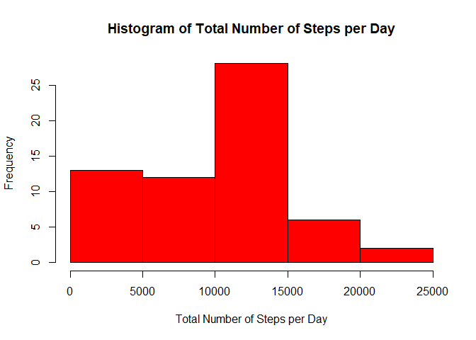
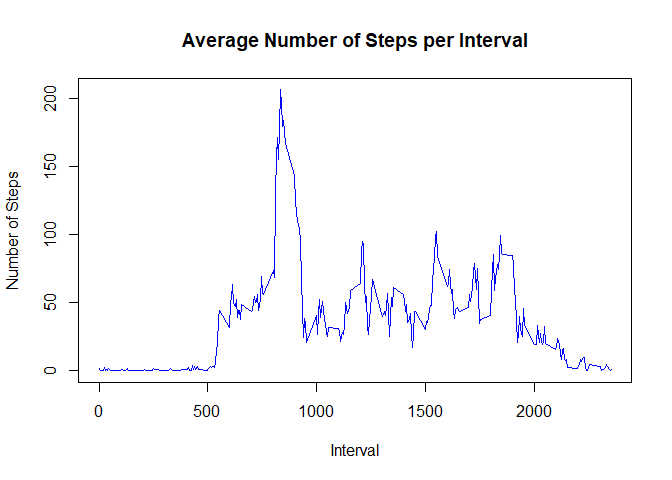
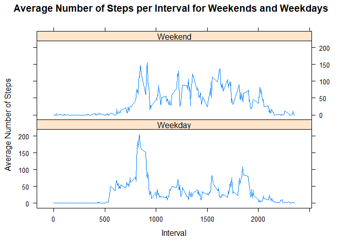

## Loading and Processing the Data

### 1 - Code for reading in the dataset and/or processing the data

First, I will check to see if "activity.csv" is in the working directory.  If not, then check the data directory for the .zip file; if the .zip file is missing, then download.  Unpack the zip file (if necessary) and read "activity.csv".

The original data can be found [here](https://d396qusza40orc.cloudfront.net/repdata%2Fdata%2Factivity.zip).


```r
if (!file.exists("activity.csv")) {
        if (!file.exists("./Data/repdata_data_activity.zip")) {
                url <- "https://d396qusza40orc.cloudfront.net/repdata%2Fdata%2Factivity.zip"
                download.file(url, destfile="/Data/repdata_data_activity.zip", mode="wb")
        }
        unzip("/Data/repdata_data_activity.zip")
}
activity <- read.csv("activity.csv")
```

## What is the mean total number of steps per day?

### 1 and 2 - Calculate the total number of steps taken per day, Histogram of total number of steps taken each day
Using ddply from plyr, I summed the number of steps taken each day and plotted the histogram.


```r
library(plyr)
steps.by.day <- ddply(activity, .(date), summarize, nsteps=sum(steps, na.rm=TRUE))
hist(steps.by.day$nsteps, xlab="Total Number of Steps per Day", main="Histogram of Total Number of Steps per Day", col="red")
```

<!-- -->

### 3 - Calculate and report the mean and median of the total number of steps taken per day

Next, I calculated the mean and median of the number of steps per day.


```r
steps.mean <- round(mean(steps.by.day$nsteps),2)
steps.median <- round(median(steps.by.day$nsteps), 2)
print(steps.mean)
```

```
## [1] 9354.23
```

```r
print(steps.median)
```

```
## [1] 10395
```

## What is the average daily activity pattern?

### 1 - Time series plot of the average number of steps taken

Similar to how I calculated the total number of steps per day above, I again used ddply to find the mean and median of the number of steps per interval.


```r
steps.by.int <- ddply(activity, .(interval), summarize, avg.steps=mean(steps, na.rm=TRUE), med.steps = median(steps, na.rm=TRUE))
head(steps.by.int)
```

```
##   interval avg.steps med.steps
## 1        0 1.7169811         0
## 2        5 0.3396226         0
## 3       10 0.1320755         0
## 4       15 0.1509434         0
## 5       20 0.0754717         0
## 6       25 2.0943396         0
```

Seems about right - now to plot the mean number of steps per interval.


```r
with(steps.by.int, plot(interval, avg.steps, type="l", col="blue", xlab = "Interval", ylab="Number of Steps", main = "Average Number of Steps per Interval"))
```

<!-- -->

### 2 - Which 5-minute interval, on average across all the days in teh dataset, contains the maximum number of steps?

As you can see in the plot, the maximum average number of steps appears to be around 9 a.m.  I will now find the maximum.


```r
max.steps <- subset(steps.by.int, avg.steps==max(avg.steps))
print(max.steps)
```

```
##     interval avg.steps med.steps
## 104      835  206.1698        19
```

The maximum number of average number of steps in any five minute period is 206 at 8:35 a.m.

## Imputing issing values

### 1 - Calculate and report the total number of missing values in the dataset (i.e., the total number of rows with NAs)

I then counted the number of rows with missing data.


```r
sum(is.na(activity$steps))
```

```
## [1] 2304
```

Of the 17568 intervals in the data set, there are 2304 with missing data, which is about 192 hours.  

### 2 and 3 - Devise a strategy for filling in all of the missing values in the dataset... Create a dataset that is equal to the original dataset but with the missing data filled in.

I then filled in in the missing data with the median for the given interval in a new data frame, activity2.  


```r
activity2 <- activity
for (i in 1:nrow(activity2)) {
        if (is.na(activity2$steps[i])) {
                activity2$steps[i] <- subset(steps.by.int, interval==activity2$interval[i])$med.steps
        }
}
sum(is.na(activity2$steps[i]))
```

```
## [1] 0
```

No more missing data!  Sort of...

### 4 - Make a histogram of the total number of steps taken each day and calculate and report the mean and median total number of steps taken each day.  Do these values differ from the estimates from the first part of the assignment? What is the impact of imputing missing data on the estimates of the total daily number of steps.

Next, I plotted the histogram of the total number of steps per day (first transforming the data as before) and calculate the new mean and new median number of steps per day.


```r
steps.by.day2 <- ddply(activity2, .(date), summarize, nsteps = sum(steps))
hist(steps.by.day2$nsteps, xlab="Total Number of Steps per Day", main="Histogram of Total Number of Steps per Day", col="purple")
```

<!-- -->

```r
steps.mean2 <- round(mean(steps.by.day2$nsteps),2)
steps.median2 <- round(median(steps.by.day2$nsteps),2)
print(steps.mean2)
```

```
## [1] 9503.87
```

The new mean of 9503.87 is greater than the previous mean of 9354.23.  This is due to the fact that steps were added to each day that was missing data, thereby increasing the total number of steps in the dataset while maintaining the number of days.


```r
print(steps.median2)
```

```
## [1] 10395
```

However, the new median of 1.0395\times 10^{4} is the same as the previous median of 1.0395\times 10^{4}.  This result is important, as it shows that replacing missing values does not change the likelihood here that the individual was more (or less) active.  Using the mean as a replacement would have had a greater chance of influencing the baseline activity level because the mean is impacted by outliers.

## Are there differences in activity patterns between weekdays and weekends?

### 1 - Create a new factor variable in the dataset with two levels - "weekday" and "weekend" indicating whether a given date is a weekday or weekend day.

Next, I examined if activity is different for weekdays and weekends.  I did this by creating a variable "wdwe" in activity2 to indicate if the date is in the weekend or is a weekday using the weekdays function.  Then, I summarized activity 2 using ddply, similar to the call used to create steps.by.int above.


```r
for (i in 1:nrow(activity2)) {
        if (weekdays(as.Date(activity2$date[i])) %in% c("Saturday", "Sunday")) {
                activity2$wdwe[i] <- "Weekend"
        } else {
                activity2$wdwe[i] <- "Weekday"
        }
}

steps.by.int2 <- ddply(activity2, .(interval, wdwe), summarize, avg.steps=mean(steps))
head(steps.by.int2)
```

```
##   interval    wdwe avg.steps
## 1        0 Weekday 2.0222222
## 2        0 Weekend 0.0000000
## 3        5 Weekday 0.4000000
## 4        5 Weekend 0.0000000
## 5       10 Weekday 0.1555556
## 6       10 Weekend 0.0000000
```

### 2 - Make a panel plot containing a time series plot (i.e. type "l") of the 5-minute interval (x-axis) and the average number of steps taken, averaged across all weekday days or weekend days (y-axis).

Finally, I used xyplot from the lattice package to create two plots of the average steps by interval, one for weekday and one for weekend dates.


```r
library(lattice)
xyplot(avg.steps ~ interval | wdwe, data=steps.by.int2, layout=c(1,2), xlab="Interval", ylab="Average Number of Steps", main="Average Number of Steps per Interval for Weekends and Weekdays", type="l")
```

<!-- -->

Thanks for the review!
